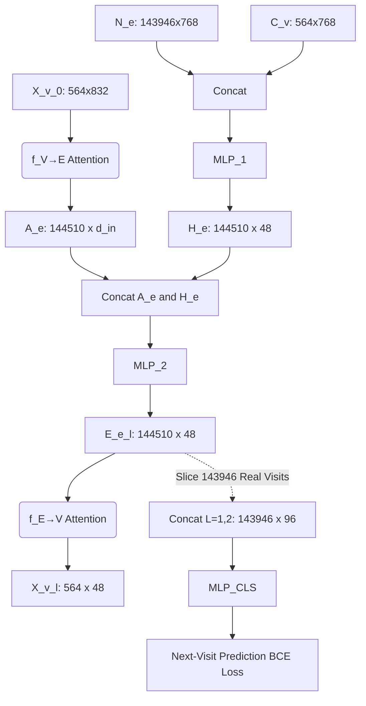

# Stage 3 Implementation Plan: MINGLE Neural Architecture

## 1. Replication Fidelity
* **A. Exact reproduction**: The custom Bipartite Graph Attention mechanism ($f_{V \rightarrow E}$ and $f_{E \rightarrow V}$), two-level semantic infusion strategy, structural DeepWalk integration, self-loop augmentation, and final MLP classifier are strictly mathematically reproduced from the original equations.
* **B. Dataset-specific adaptation**: We use the synthetic general EHR Coherent dataset rather than the ICU-specific MIMIC-III dataset.
* **C. Embedding-model substitution**: We use local `NeuML/biomedbert-base-embeddings` (768d) rather than OpenAI's paid `text-embedding-ada-002` (1536d) to accommodate open-source, local processing constraints.
* **D. Experimental-task differences**: The original task predicted 25 pre-defined MIMIC-III ICU conditions. We predict the Top 25 most frequent conditions present in the Coherent dataset.

## 2. Paper Review & Architectural Understanding
MINGLE architecture reproduced as closely as possible; dataset and semantic encoder differ. The framework uses a two-level infusion strategy to combine medical concept semantics ($C_v$) and clinical note semantics ($N_e$) into hypergraph neural networks. We will implement the mathematical MINGLE attention mechanism directly in PyTorch, preserving:
- Permutation/set invariance
- Multi-head attention over bipartite incident nodes/edges
- Learnable query representations, key/value projections
- LayerNorm, residual connections, and Feed-Forward Networks (FFN)

## 3. Tensor Mapping & Roles
* **$S_v$ (564, 64)**: Node structural embeddings from DeepWalk.
* **$C_v$ (564, 768)**: Node semantic embeddings from BiomedBERT.
* **$N_e$ (143,946, 768)**: Hyperedge (visit) note embeddings from BiomedBERT.
* **$X_v^{(0)}$ (564, 832)**: Initial node representations formed by concatenating $[S_v ; C_v]$.
* **$N_{aug}$ (144,510, 768)**: Augmented semantic matrix formed by concatenating real notes ($N_e$) with concept semantics ($C_v$) to represent self-loops.
* **$H_e$ (144,510, 48)**: Projected semantic hyperedge features.
* **$E_e^{(l)}$ (144,510, 48)**: Latent representation of hyperedges at layer $l$.
* **$X_v^{(l)}$ (564, 48)**: Latent representation of nodes at layer $l$.

## 4. Dimensionality Flow & MLP Structures
We initialize with the requested hyperparameters: **Hidden dimension $d = 48$**, **Layers $L = 2$**.

**A. Semantic Infusion ($H_e$ & $\text{MLP}_1$)**
* $N_{aug} = [N_e ; C_v] \in \mathbb{R}^{(143946 + 564) \times 768} = \mathbb{R}^{144510 \times 768}$
* $\text{MLP}_1$ projects $768 \rightarrow 48$.
* Output $H_e \in \mathbb{R}^{144510 \times 48}$.

**B. Layer $l$ Update (Eq 7 & 1)**
Let $d_{in}$ be the node dimension at the start of layer $l$ (832 for $l=1$, 48 for $l=2$).
1. **Node $\rightarrow$ Hyperedge ($f_{V \rightarrow E}$)**: Attends over nodes to update hyperedges. Output $A_e \in \mathbb{R}^{144510 \times d_{in}}$.
2. **$\text{MLP}_2$**: Takes $[A_e ; H_e]$ (dimension $d_{in} + 48$) and projects back to $48$.
   * Output $E_e^{(l)} \in \mathbb{R}^{144510 \times 48}$.
3. **Hyperedge $\rightarrow$ Node ($f_{E \rightarrow V}$)**: Attends over hyperedges to update nodes. 
   * Output $X_v^{(l)} \in \mathbb{R}^{564 \times 48}$.

**C. Final Prediction ($\text{MLP}_{CLS}$)**
* We slice the first 143,946 rows (dropping the 564 self-loops) to isolate genuine visit hyperedges.
* Concatenate across layers: $||_{l=1}^2 E_e^{(l)} \in \mathbb{R}^{143946 \times 96}$.
* $\text{MLP}_{CLS}$ projects $96 \rightarrow 25$ (the number of target conditions).

## 5. Self-Loops & Incidence Matrix Augmentation
* **Real Hyperedges**: 143,946
* **Self-Loop Hyperedges**: 564
* **Total Augmented Hyperedges**: 144,510
The incidence matrix $A \in \{0,1\}^{564 \times 144510}$ handles the message passing topography. The 564 self-loop hyperedges act purely as structural information retainers and must NOT accidentally become prediction targets.

## 6. Message Passing Mechanism ($f_{V \rightarrow E}$ and $f_{E \rightarrow V}$)
We will write custom PyTorch `nn.Module` classes representing the exact multi-head attention equations specified. The node representations will be projected into Keys and Values, and a learnable Query vector will attend to them, followed by standard transformer-style LayerNorm and FFN modules to guarantee permutation invariance.

## 7. Prediction Task Alignment & Feasibility
> [!WARNING]
> **Prediction Task**: Given encounter $t$, predict the presence of the 25 most frequent conditions in encounter $t+1$ for the same patient.
> 
> **Label Feasibility Results**: As documented in `stage3_label_feasibility.md`, the Coherent dataset suffers from severe label sparsity. While there are 142,668 valid $t \rightarrow t+1$ training pairs, 19 out of the 25 classes have a positive prevalence of <1%. The most frequent class has only a 9.47% prevalence.
> 
> **Action Plan**: Use MINGLE Eq. (4) via `BCEWithLogitsLoss` on these sparse targets. No focal loss, class weights, or oversampling in Stage 3.

## 8. Proposed Architecture Pipeline

